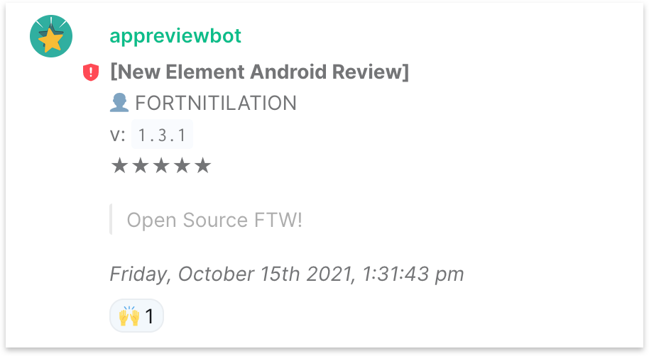

## Matrix App Store Review Bot


A nodejs Matrix bot to track your application reviews in real time.

Based on https://github.com/turt2live/matrix-bot-sdk

Reviews are scraped from the stores using:
- [google-play-scraper](https://github.com/facundoolano/google-play-scraper) for google reviews
- Apple review rss feed for Apple's AppStore reviews




## Installation Guide

Checkout this project and then install with npm

````
git clone https://github.com/BillCarsonFr/matrix-review-bot.git
cd matrix-review-bot
npm install
````

Setup the bot config

````
cp conf/config-sample.json conf/config.json
````

Create the matrix account for your bot, and get the [access token](https://t2bot.io/docs/access_tokens/)
Then update the config file with these information

````
{
    "bot" : {
        "homeserverUrl" : "http://localhost:8080",
        "accessToken": "YOUR ACCESS TOKEN"
    },
    ...
````

Get the room_id of the room where you want your bot to operate (Room Settings > Advanced)
Then add a new section in the config file for that room.

````
 "rooms" : {
        "<<THE ROOMID>>" : {
            "skipFirstLoad" : true,
            "watchedApps" : [
                {
                    "type" : "android",
                    "appId" : "com.example.myapp",
                    "language": ["us-en","fr-fr","de-de"]
                },
                {
                    "type" : "ios",
                    "appId" : "9digitsId",
                    "language": ["us","fr","de"]
                }
            ]
        },
        [...]
````

You can get the `appId` from the web page of the application store for your app
e.g

 play.google.com/store/apps/details?id=**im.vector.app**&hl=en&gl=US
 
 apps.apple.com/us/app/element-messenger/id**1083446067**
 
 
 ## Start the bot
 
 ````
  node src/index.js
 ````
 
 
 ## Invite the bot!
 
 Now you can just simply invite the bot in the configured room.
 You will get a message when the bot join.
 
 You can also do a quick test with `!review test`
